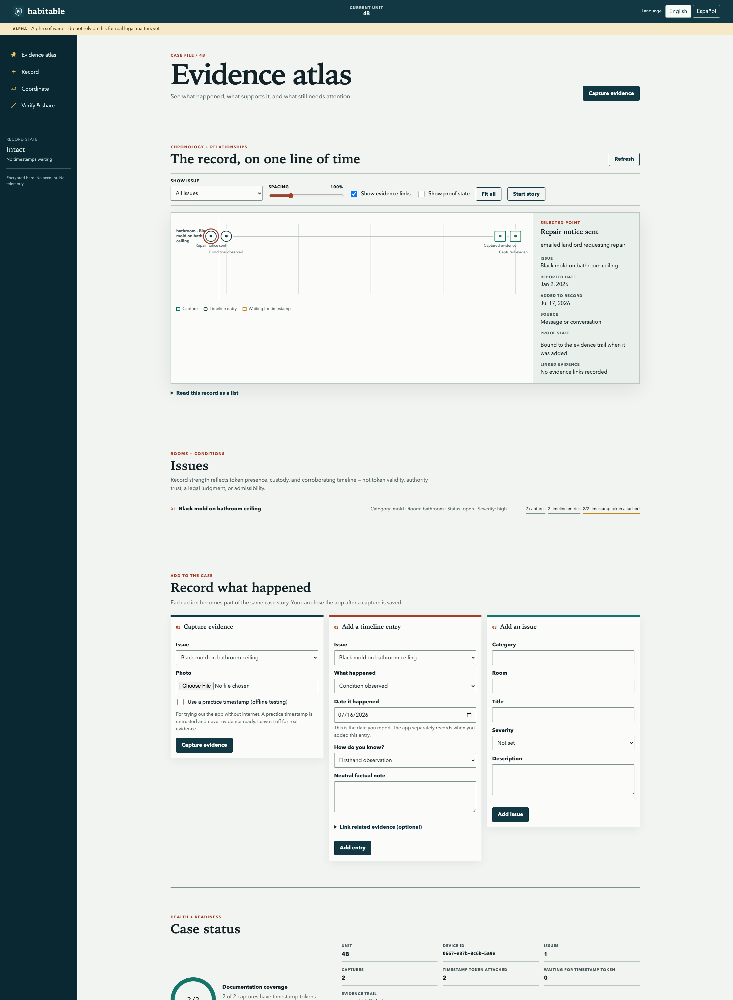
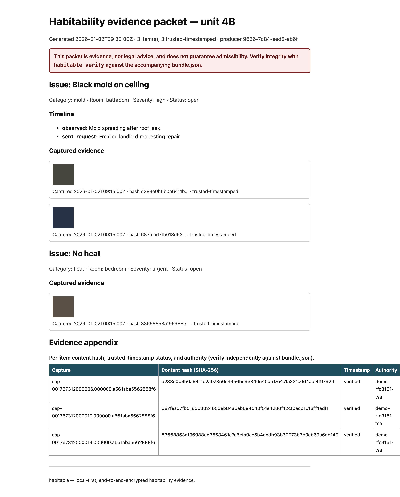

# habitable — verifiable habitability documentation for tenant unions, offline and encrypted

[](https://scorecard.dev/viewer/?uri=github.com/ChelseaKR/habitable)
— an honest, itemized supply-chain self-assessment; see the dated report at
[`docs/audits/scorecard-2026-07.md`](docs/audits/scorecard-2026-07.md) for what the current number means and what moves it.

> A privacy-first, offline-capable tool that lets tenants and their unions document repair and
> habitability problems as a checkable record. Captured media receives a content hash, an RFC 3161
> timestamp token, and chain-of-custody records; sourced timeline events separately record when
> something reportedly happened, when it was added, and how it is known, then bind that assertion to
> custody. The result is a signed review packet for a tenant, organizer, lawyer, court, or housing
> inspector—without a promise that any forum will accept it. Everything is local-first and
> end-to-end encrypted; organizers sync directly between devices without a central server. The threat
> model assumes a landlord who retaliates, so there is no server-side personal data, no central
> authority over a union's records, and no third party who can be subpoenaed for what the union holds.
> The union owns its data.

**Status:** working reference implementation · **alpha** — the evidence core, CLI, peer-to-peer
sync, standalone verifier, and bilingual (EN/ES) local web app are implemented and automatically
tested on Python 3.14 (`make verify` green; the app has `axe-core`, keyboard, and reflow checks).
No independent security/legal review, real tenant-union pilot, recorded human screen-reader pass,
or signed native app-store package has been completed, so
**do not rely on this for real legal matters yet** ·
independent personal open-source project · AGPL-3.0 ·
unaffiliated with any employer or client; contains no proprietary or client material; not a
government system and not built for a government customer.

See the current **[capability and claim ledger](docs/capabilities.md)** for the evidence behind each
shipped, partial, planned, or externally unvalidated claim.

**Supported versions:** pre-1.0, only the **latest release** is supported (see `SECURITY.md`).

**Why this domain.** A tenant withholding rent or fighting an eviction over a broken heater needs
proof, and proof is exactly what the housing-power imbalance denies them: the landlord controls the
property, the maintenance records, and often the only timeline anyone wrote down. Tenants take phone
photos, but a bare JPEG with editable EXIF data is weak evidence and a date a landlord's lawyer will
contest. Existing apps that promise to fix this usually do it by uploading every tenant's photos and
home address to a company's cloud, which creates a single honeypot and a single party to be
pressured, breached, or subpoenaed. habitable inverts that. The evidence lives on the tenant's
device, encrypted; content hashes and RFC 3161 tokens make later changes detectable; and unions sync
peer to peer so no company sits between a tenant and their own records. It is the privacy and
local-first sibling to the civic-data projects in this portfolio, and it carries their discipline on
auditability, accessibility, and saying plainly what the tool does not do.

---

## What it does

- **Captures** a habitability issue as a structured record: photos and short video, a condition note,
  a category (heat, mold, pests, water, electrical, structural), the affected room, and a timeline of
  observations as the problem persists or recurs.
- **Makes each media capture tamper-evident.** At capture the tool computes a content hash (SHA-256) of the
  original media, seals the original file unmodified, and writes an append-only chain-of-custody
  entry — all instantly and fully offline. It then obtains an **RFC 3161 timestamp token** over
  that hash as soon as the device has connectivity, showing the item as *awaiting-timestamp* until
  the signed token is attached. Authority trust is a separate verification step that requires an
  accepted certificate anchor. EXIF is handled explicitly: the original (including its embedded capture
  time and any GPS) is retained sealed for evidentiary integrity, while any copy a tenant chooses to
  share can have location stripped.
- **Logs a sourced timeline** per issue: reviewed event choices for conditions, repair notices,
  delivery, responses, inspections, repairs, recurrence, and impact, plus an honest Other choice.
  Each entry separates the reported `occurred_at` date from device-generated `recorded_at`, can link
  captures/notices/receipts/responses, and is committed into the signed custody chain. Timeline device
  time is not an RFC 3161 timestamp and does not independently prove when the event happened.
- **Syncs peer to peer.** An organizer and the tenants on a case keep records in step over
  end-to-end-encrypted, direct device-to-device sync using a CRDT, so two people editing the same
  case offline merge cleanly when they reconnect. Signed, recipient-sealed pairing pins the exact
  expected peer and case before any delta can merge; replayed deltas are detected and skipped. No
  server holds the plaintext, and no server is required at all.
- **Exports a court/inspector-organized review bundle.** One command assembles a paginated PDF,
  accessible HTML rendering, and structured `bundle.json` for a whole unit: a cover
  sheet, chronological evidence timeline, per-issue detail, and a chain-of-custody/integrity
  summary. Issue/date-scoped packet exports currently fail closed because packet v3 can carry only
  the complete custody chain. Technical integrity is independently checkable; legal, court, and
  inspector usefulness remain externally unvalidated.
- **Shares with an organizer, end to end.** A tenant can hand a full case, optionally with the
  `unit` metadata field omitted, to a tenant-union organizer who was not on the case,
  signed and **sealed to the organizer's verified public key**, so any relay or courier sees only
  ciphertext. Issue-subset shares currently fail closed for the same complete-custody reason
  (`habitable share` / `receive`; trust model in `docs/sharing-trust-model.md`). Omitting that one
  field is not anonymization: case identifiers, descriptions, custody identifiers, or original
  media metadata can still reveal the unit.
- **Drafts the repair request.** From the logged evidence, `habitable letter` generates a dated
  repair-request / notice letter to the landlord (accessible HTML + PDF), with jurisdiction-aware
  *framing only* and a standing "not legal advice" disclaimer (`docs/letter-generator.md`). Its
  wording and delivery workflow have not been validated by legal counsel or a pilot partner.

```console
$ habitable export --vault ./case-vault --out ./4B-packet
$ habitable verify ./4B-packet
$ habitable verify --trusted-cert ./tsa-root.pem ./4B-packet  # additionally anchor TSA trust
```

The verification command is the point: a packet is not "trust me." It exposes technical claims a
third party can re-check. Without `--trusted-cert`, token imprint/signature and structural integrity
are reported separately, but the command exits non-zero and does not call the packet evidence-ready.
Development timestamps are never evidence-ready. Technical readiness does not decide admissibility
or any legal outcome.

---

## Try it

Requires [uv](https://docs.astral.sh/uv/); the right Python (3.14) is fetched automatically.

```console
$ uv sync                 # create the env and install habitable + dev tools
$ uv run habitable demo   # capture → seal+hash → RFC 3161 → packet → verify, on synthetic data, offline
$ make verify             # the full gate: ruff + mypy --strict + pytest (property-based + tamper-detection)
```

`habitable demo` fabricates a couple of photos with embedded location, captures them as evidence,
builds a packet (location stripped from the shared copies), and independently verifies it — with no
network and no real tenant data. From there: `uv run habitable --help`.

**Just want to look?** There is deliberately no hosted app (it runs on `localhost` so your case never
leaves the device), but a static **[landing page + live sample packet](https://chelseakr.github.io/habitable/)**
shows what it produces. A safe phone package is **not shipped yet**; see the honest
[`docs/mobile.md`](docs/mobile.md) support boundary. To run the optional sync relay, see
[`docs/relay-deploy.md`](docs/relay-deploy.md); to sync a case with no network at all — an
encrypted delta on a USB stick or SD card — see [`docs/sneakernet-sync.md`](docs/sneakernet-sync.md).

## Screenshots

| The local app (English / Español) | An exported, verifiable packet |
| --- | --- |
|  |  |

The app is bilingual (EN/ES) and has automated axe, keyboard, and reflow coverage; a human
screen-reader pass remains open. Every export ships an axe-tested `packet.html`, a paginated PDF,
and a verifiable `bundle.json`.

---

## Hard rules (enforced, not aspirational)

1. **No server-side personal data, ever.** There is no central database of tenants, addresses,
   photos, or cases. Plaintext never leaves a device unencrypted. The only optional network
   components are a sync relay that sees ciphertext alone and a public timestamp authority that sees
   a hash, never the file. A relay still observes connection *metadata* — which peers connect, when,
   and roughly how much moves — even though it can read none of the contents; the mitigations are a
   no-log, self-hostable relay and pure peer-to-peer sync with no relay at all, detailed in
   `docs/threat-model.md`. Nothing the project operates can be subpoenaed for a tenant's contents,
   because it never holds them. Don't take our word for it: `habitable prove-no-plaintext` runs a
   real sync through an in-process relay, captures every byte on the wire, and greps it for planted
   plaintext markers — or capture a real relay with `tcpdump` yourself, per
   [`docs/prove-no-plaintext.md`](docs/prove-no-plaintext.md).
2. **No central authority over a union's records.** Each union holds its own keys and its own data;
   the project ships no account system, no admin who can read or revoke a union's evidence, and no
   hosted service that owns the records. Forking the code or running the relay yourself changes
   nothing about who can read the data: still no one but the keyholders.
3. **Tamper-evidence is mandatory for captured items, not optional.** Every captured item gets a
   content hash at capture; supported handling actions enter an append-only, hash-linked custody
   log; and an RFC 3161 token is requested when connectivity is available. Timeline notes do not
   receive those per-item proofs. Export and verification surface missing timestamps or integrity
   failures instead of silently describing them as complete.
4. **Originals are sealed; sharing is a deliberate, minimizing act.** The original media is preserved
   byte-for-byte for integrity. Any shared or exported copy strips location by default, and the user
   is shown exactly what a packet will disclose before it is produced. The tool never silently
   publishes a home's coordinates.
5. **Retaliation is the threat model.** Defaults assume an adversary with resources and motive: data
   at rest is encrypted; a duress-safe open state that hides case contents is *planned but not yet
   implemented* — today the only at-rest protection is vault encryption, and when built that state
   will be a mitigation with documented limits, not a guarantee against a coercing or forensic
   adversary — and the tool collects no analytics and phones no home. The union decides what to
   disclose and to whom, documented in `docs/threat-model.md`.

---

## Honest limits — what habitable does not do

Being precise about the boundaries is part of being credible; a tool that overpromises in a courtroom
fails the people relying on it.

- **Not legal advice, and no guarantee of admissibility.** habitable produces well-documented
  evidence. Whether a court or agency admits it, or how much weight it carries, is a legal question
  this tool cannot answer.
- **It cannot manufacture a case the facts do not support.** Tamper-evidence shows an item was not
  altered after capture, and a timestamp bounds when it existed; neither proves the underlying
  condition was as a tenant describes. The tool strengthens true records, it does not create them.
- **It hosts nothing.** There is no account, no cloud of cases, and no operator who can read, produce,
  or revoke a union's data — which also means a lost key with no backup means lost data (see
  *Recoverability*).
- **A relay sees metadata, not contents.** A sync relay, if used, reads only ciphertext but can still
  observe who syncs with whom and when; pure peer-to-peer sync avoids even that.
- **A timestamp authority sees a hash, not the file** — and an RFC 3161 token bounds *when* content
  existed, not *who* created it or *what* it depicts.
- **Duress and forensic limits.** The duress-safe state is *planned, not yet implemented*; today the
  only at-rest protection is vault encryption. When built it will hide case contents but will not be a
  guarantee against a sufficiently capable coercing or forensic adversary, and those documented limits
  will apply.

The full threat model and the mitigation for each limit live in `docs/threat-model.md`.

---

## Architecture

```
habitable/
├── README.md
├── src/habitable/
│   ├── capture.py                 # media intake → hash → RFC 3161 timestamp → seal original
│   ├── evidence.py                # content hashing, fixity checks, chain-of-custody log
│   ├── exif.py                    # explicit EXIF handling: seal original, strip shared copies
│   ├── model.py                   # CRDT document model for cases/issues/timeline (offline-first)
│   ├── crypto.py                  # local encryption at rest; E2E sync keys; key backup/rotation
│   ├── sync.py                    # peer-to-peer encrypted sync; relay client sees ciphertext only
│   ├── packet.py                  # assemble court/inspector PDF + evidence appendix
│   ├── verify.py                  # independent verification of hashes, timestamps, custody
│   └── config.py                  # timestamp authorities, sync peers, policy as versioned files
├── app/                           # local-first client (PWA / desktop): capture, review, export
├── relay/                         # optional ciphertext-only sync relay (encrypted deltas + metadata, never contents)
├── tests/
│   ├── fixtures/                  # sample cases, tampered items, broken chains for verify tests
│   └── ...                        # unit, property-based, and tamper-detection tests
├── docs/                          # ARCHITECTURE, threat-model.md, privacy.md, sustainability.md, evidence-method.md, governance.md, ADRs, audits/ (+ onboarding, baseline), accessibility/, recruitment/ (call for reviewers)
└── pyproject.toml
```

The data model is a CRDT document per case, stored encrypted on each device, so the app is fully
usable with no network and two organizers editing the same case offline converge without conflict
when they sync. Capture is a pipeline: media in, original sealed and hashed, a timestamp token
fetched over the hash, a custody entry appended. Sync moves authenticated, case-bound encrypted
deltas directly between explicitly paired peers or through a relay that only ever sees ciphertext,
so adding a relay adds availability without adding a party that can read anything. See the
[sync protocol](docs/sync-protocol-v2.md) and [sync threat model](docs/sync-threat-model.md).
Verification is a separate module with no dependency on the rest, so a
court or an opposing party can check a packet with a small, auditable tool.

---

## The evidence engine

A photo is only as good as the answer to "how do we know it wasn't edited, and that it was taken
when you say?" habitable is built so those answers are independently checkable rather than asserted.

- **Fixity at capture.** The moment media is captured or imported, the original bytes are hashed
  (SHA-256) and written to a sealed case vault that the app treats as immutable. Any later read
  re-checks the hash, so silent corruption or tampering shows up as a failed fixity check, not a
  quietly altered exhibit.
- **RFC 3161 timestamp tokens.** The hash — never the photo — is sent to an **RFC 3161** timestamp
  authority, which returns a signed token showing the exact content existed *no later than* that
  time. This is an upper bound on existence, not proof of capture time, authorship, or depiction.
  Capture never blocks on the network: offline, the item is hashed and sealed
  instantly and the request is queued, the item showing an *awaiting-timestamp* status until
  connectivity lets the token be fetched and attached. Multiple authorities can be configured so the
  proof does not rest on one party, and the tokens travel inside the packet for offline verification.
- **Chain of custody.** Supported handling actions on captured items — such as capture, fixity
  checking, timestamping, copying for sharing, and packet inclusion — enter an append-only,
  hash-linked log. A break or reordering in the chain is
  detectable, and the export reports it rather than presenting a compromised item as clean.
- **EXIF handled on purpose.** The sealed original keeps its embedded capture time and any GPS,
  because that metadata is part of the evidentiary record. Shared and exported copies strip location
  by default so producing a packet does not leak where a tenant lives, and the tool shows precisely
  which metadata each output retains or removes.
- **Independently verifiable.** `habitable verify` re-derives shared-media hashes, validates each
  timestamp token's imprint/signature, and walks the custody chain using the packet alone. Passing
  `--trusted-cert` additionally requires the timestamp certificate to chain to a root the recipient
  selected. Packets that embed originals also permit original-byte fixity checks. Because a TSA's
  signing certificate eventually expires, long-held packets can be
  re-timestamped (an archive timestamp over the existing token) so old evidence keeps verifying. The
  verification tool is small and auditable on its own, so a skeptic can confirm a packet without
  trusting this project.

---

## Quality attributes (engineered for, not assumed)

Each decision below answers to a specific quality attribute, grouped into clusters for readability.
An evidence tool under an adversarial threat model lives or dies on integrity, confidentiality, and
verifiability, so those clusters carry the most weight.

### Integrity, evidence, and trust in the record
**Correctness** and **accuracy** — captures preserve original bytes and metadata; the timeline keeps
reported occurrence time, device recording time, source, and related records distinct. **Precision**
and **fidelity** — originals are sealed byte-for-byte with no re-encoding; hashes pin exact content,
and timestamp tokens bound existence no later than their stated time. **Integrity**
— content hashing plus append-only, hash-linked custody makes any alteration detectable. **Auditability**
— every item carries its hash, timestamp token, and a verifiable custody-integrity proof, while the
full who-did-what trail stays in the union's vault rather than being exported.
**Provability** — packet integrity claims are mechanically checkable; authority trust requires a
recipient-selected certificate anchor. **Traceability** — capture → seal → custody entries → packet
item is recorded end to end.
**Determinability** and **predictability** — verification of the same packet yields the same verdict on
any machine. **Repeatability** — `habitable verify` reproduces fixity and timestamp checks
deterministically. **Relevance** and **effectiveness** are unvalidated hypotheses: a real legal
review and pilot must determine whether the packet contains what a court or inspector needs.

### Privacy, security, accountability, autonomy
**Confidentiality** and **securability** — end-to-end encryption at rest and in sync; the relay and the
timestamp authority see ciphertext or a bare hash, never contents; no analytics, no telemetry.
**Integrity** (supply chain) — pinned, hashed dependencies; Sigstore-signed build-provenance
attestations per release (signed release **tags** are in progress — see `docs/releasing.md`);
GitHub Actions pinned to commit SHAs.
**Vulnerability** management — pip-audit, gitleaks, and CodeQL in CI; a published threat model and
SECURITY policy with a disclosure path. **Accountability** — append-only custody logs and committed
`docs/audits/` record who did what to the data, while no outside party can read the data itself.
**Credibility** and **transparency** — the README states plainly what the tool is *not* (see *Honest
limits — what habitable does not do*) and how each guarantee is enforced, rather than asking for trust.
**Autonomy** — each union holds its own keys and records; there is no operator who can revoke, read, or
seize them.

### Usability, learnability, reach
**Accessibility** — automated axe, keyboard, and reflow checks are merge gates; no recorded human
screen-reader pass or full WCAG conformance determination exists. **Usability**, **learnability**,
and **intuitiveness** remain pilot questions rather than shipped guarantees. There is no central
account to create. **Interactivity** and
**responsiveness** — capture and review work instantly on-device with no network wait. **Discoverability**
— a guided first case and an in-app explanation of what makes a strong record. **Demonstrability** —
`make demo` walks a sample case from capture to verified packet with no real tenant data.
**Understandability** — each item shows its evidence status (hashed, timestamped, custody intact) in
plain words. **Seamlessness** — capture, sync, and export operate on one local document.
**Localizability** — app strings live in per-language bundles with automated EN/ES parity; human
Spanish language/accessibility review is still open. **Mobility** — the responsive PWA shell exists,
but there is no reviewed, self-contained phone package and phone setup has not been validated in a
real pilot.

### Dependability, resilience, safety
**Dependability** and **reliability** — the app is fully functional offline; loss of network never
blocks capturing evidence. **Availability** — there is no central service whose downtime stops a tenant;
the relay is optional and replaceable. **Fault-tolerance**, **resilience**, **robustness**, and
**survivability** — CRDT merges tolerate concurrent offline edits; a corrupted item is flagged by
fixity rather than crashing the case. Data survives device loss only if the user has already made a
usable backup or synced an authorized peer. **Recoverability** — tested recovery mechanisms exist,
but their real-world ceremony has not been piloted. **Degradability** and **failure transparency** — a
missing timestamp token or a broken chain is shown as a degraded evidence status, never silently passed
as clean. **Redundancy** — multiple sync peers and configurable multiple timestamp authorities remove
single points of failure. **Stability** and **durability** — sealed originals are immutable; semver on
the packet format and verification protocol. **Safety** — location-stripped sharing reduces harm to the
tenant, and a duress-safe open state (planned, not yet implemented; with the limits set out in the hard
rules and *Honest limits*) is intended to add to that; the tool frames outputs as documentation, never
as legal advice or a promise of a court outcome.

### Performance, scale, cost
**Efficiency** — hashing and sync deltas are incremental; the app does not re-process sealed media.
**Scalability** and **elasticity** — sync is peer to peer with no central bottleneck; a relay, if used,
forwards ciphertext and scales to zero between sessions. **Timeliness** — capture, hashing, and sealing
complete within a perceptible moment with no network in the loop, and the RFC 3161 token is fetched
asynchronously once the device is online; [latency budgets for the local path](docs/performance-budget.md) are asserted in CI.
**Affordability** — the tool is free, uses free public timestamp authorities, and needs no paid
infrastructure. Running safely on a tenant's existing phone remains a packaging goal, not a current
claim. **Process capabilities** and
**producibility** — `make verify` reproduces the full gate; a release is one tagged, signed command.

### Maintainability, evolvability, modularity
**Maintainability**, **modifiability**, and **evolvability** — small modules behind interfaces; ruff +
mypy strict; the timestamp-authority and sync-transport layers are pluggable. **Extensibility** and
**flexibility** — new issue categories, export templates, and timestamp authorities plug in without
touching the evidence core. **Adaptability** — the packet template adapts to a jurisdiction's
expectations through config, with the verification protocol unchanged. **Modularity**, **composability**,
and **orthogonality** — capture, evidence, crypto, sync, packet, and verify are independent layers, and
verify depends on none of the others. **Simplicity** — local files and a CRDT, no server, no account
system. **Reusability** — the evidence and verify modules are importable and could harden capture in
another local-first tool. **Analyzability** — typed, documented, with an architecture and threat-model
doc. **Configurability**, **customizability**, and **tailorability** — one config sets authorities, sync
peers, sharing policy, and language. **Upgradability** — pinned dependencies with a documented bump path;
the packet format is versioned so old packets still verify.

### Operability, serviceability, sustainability
**Operability** and **manageability** — the optional relay ships with a runbook and a health endpoint; an
organizer needs none of it to work. **Administrability** — there is nothing to administer centrally;
policy is committed config a union edits for itself. **Observability** — on-device logs of capture and
sync events, kept local and never exfiltrated; the relay logs only ciphertext-passthrough metrics.
**Debuggability** — a case can be traced from capture through custody to packet under a debug flag,
without exposing plaintext off-device. **Serviceability / supportability** and **repairability** — issue
templates and a "reproduce on sample data" path; most fixes are template or config edits, and the
verification tool stands alone for support. **Deployability** and **installability** — the repository
builds and smoke-tests a wheel/sdist, and its tag workflow is wired for PyPI Trusted Publishing after
one-time external setup. This does not imply a release has successfully published. No signed native
package exists; the optional relay has a documented container deployment. **Agility** — a CI smoke
suite on every PR. **Autonomy**, **self-sustainability**, and **sustainability** — no paid dependency and
no service to fund, so a union keeps the tool working with no budget and no vendor.

### Compatibility, interoperability, standards, verification
**Compatibility** and **interoperability** — RFC 3161 timestamps and SHA-256 hashes are standard and
verifiable with off-the-shelf tools; packets are PDF plus a structured machine-readable bundle.
**Interchangeability** — timestamp authorities and sync transports swap without touching callers; a
packet verifies with the bundled tool or with general-purpose RFC 3161 and hashing utilities.
**Standards use and targets** — RFC 3161 and SHA-256 are implemented; WCAG 2.2 AA is a target with
automated partial coverage, not a current conformance claim. The project also uses semver,
conventional commits, SPDX headers, and AGPL-3.0. **Inspectability** — hashes, tokens, and custody logs are
viewable and independently checkable. **Composability** — the structured bundle is plain data a legal-aid
tool could ingest. **Testability** — fixtures of clean, tampered, and chain-broken cases make the
evidence and verify paths unit-testable; verification attributes (provability, repeatability,
reproducibility, traceability, demonstrability) are covered above and exercised by the verify tool itself.

### Distribution, portability, installation
**Distributability** — source distributions, wheels, PWA assets, and a relay container can be built
from the repository; tagged releases are configured for PyPI Trusted Publishing, subject to the
documented one-time registry setup. **Portability** — encrypted files are movable and the browser client is designed
for desktop/mobile browsers, but those paths have not been established by signed native packages or
a real-device pilot. **Deployability** — the relay is optional and self-hostable.

---

## Accessibility and Section 508 conformance

habitable targets **WCAG 2.2 Level AA** and conformance with the **Revised Section 508 Standards**
(36 CFR Part 1194), which incorporate WCAG 2.0 A/AA by reference for web content and add the functional
performance criteria of Chapter 3. A tenant-union tool is not federal ICT, so Section 508 is not legally
required here. Building to it anyway is a values position and a practical one: disabled tenants face
housing discrimination and habitability harms at high rates, and a tool meant to give tenants power that
a disabled tenant cannot operate has failed at its purpose. Conforming to the standard governments audit
to also makes the packets and the app usable to the legal-aid workers and inspectors who receive them.

- A committed **Accessibility Conformance Report (ACR)** using the **VPAT 2.5 (Rev 508)** template lives
  at `docs/accessibility/ACR.md`, with tables for the WCAG 2.x A/AA success criteria, the Revised 508
  software (Chapter 5) and support-documentation (Chapter 6) criteria, and the **Functional Performance
  Criteria** (use without vision, with limited vision, without hearing, with limited reach and strength,
  with limited cognition).
- Every visual evidence-status indicator has a **text equivalent**. Automated tests cover keyboard
  navigation and structure, but only a human pass can establish real screen-reader usability. The
  exported PDF has selectable text, language metadata, and outlines but is **not tagged PDF/UA**;
  `packet.html` is the designated accessible rendering.
- The app passes automated checks (axe) and has a **documented manual screen-reader protocol**
  (`docs/accessibility/manual-testing.md`); a *recorded* NVDA/VoiceOver pass is a v1.0 gate item still
  open (see `docs/accessibility/ACR.md`) — capture works without precise pointer control, and time
  limits are avoidable so a tenant documenting under stress is not rushed.
- Automated accessibility checks are a **merge-blocking CI gate**; a mechanical regression fails the
  build. Human screen-reader and language review remain separate release gates.

---

## Build plan

Phases 1–3 are **implemented** at the library + CLI level and covered by tests; Phase 4 (the
installable end-user app and localization) is the remaining work. For the strategic, multi-year
view beyond these phases — assurance, accessibility, platform, governance, and the v1.0 gate —
see **[`ROADMAP.md`](ROADMAP.md)**.

- **Phase 1 — capture and evidence core.** ✅ Media capture, content hashing, sealed originals, the
  append-only custody log, and explicit EXIF handling. Local encrypted storage. Definition of done: an
  issue can be captured offline and an item's fixity and metadata handling verified locally.
- **Phase 2 — timestamps, packets, and verification.** ✅ RFC 3161 timestamping over hashes; the
  review PDF/HTML with an evidence appendix; the standalone `verify` tool. Tamper-detection tests
  against fixtures of altered and chain-broken items.
- **Phase 3 — local-first sync.** ✅ The CRDT case model, end-to-end-encrypted peer-to-peer sync, the
  optional ciphertext-only relay, and encrypted backup with key rotation. Concurrent-offline-edit
  convergence tested (property-based).
- **Phase 4 — app accessibility automation and generalization.** Partially done: a bilingual (EN/ES)
  web app (`habitable app`) gated by **axe-core** scans plus structural + i18n-parity
  tests (✅); an **installable PWA** with PNG/maskable icons, Apple touch icon, and an offline service
  worker (✅, see `docs/mobile.md`); an **accessible `packet.html`** rendering that passes the same axe
  gate, alongside a PDF that declares its language and carries a navigable outline (✅); configurable
  packet templates (✅), the threat-model doc (✅), the setup guide (✅), and a documented manual
  screen-reader protocol (✅ `docs/accessibility/manual-testing.md`). **Remaining:** a *recorded* human
  NVDA/VoiceOver pass; a fully tagged **PDF/UA** structure tree (not available in reportlab's
  open-source API — the HTML packet is the accessible rendering until then); and signed native
  app-store binaries or another independently reviewed on-device package. Automated checks do not
  by themselves establish WCAG conformance.

---

## Engineering and open-source practices

### Standards conformance

This repo is developed against a portfolio-wide set of engineering standards
(quality, security, CI/CD, release, accessibility, observability, i18n,
AI-evaluation, documentation, and a responsible-tech framework). Per that
standard's own README, silent omission of this declaration is itself a defect
— so here it is, stated rather than left implicit. "Applies" does not mean
"fully conformant"; it means the standard's controls are in scope and tracked,
with open gaps named rather than hidden.

| # | Standard | Applies? | Where it's tracked |
|---|---|---|---|
| 1 | Quality & metrics | Applies (all repos) | `make verify` (coverage floor, complexity gate); [Definition of done](#definition-of-done) below |
| 2 | Code quality | Applies (Python; TS/Node/frontend-toolchain controls are N/A — the PWA is no-build vanilla JS with no `package.json`) | `pyproject.toml` (ruff + mypy --strict config); `.pre-commit-config.yaml` |
| 3 | Security & supply chain | Applies (ships code, releases, and a Dockerfile for the relay) | `SECURITY.md`; `.github/workflows/ci.yml` (gitleaks), `secret-scan-scheduled.yml` (TruffleHog), `codeql.yml`, `zizmor.yml`; `docs/audits/scorecard-2026-07.md` |
| 4 | CI/CD | Applies (workflows under `.github/workflows/`) | This README's build/verify description; `.github/rulesets/` (branch/tag ruleset — drafted, not yet applied, see the remediation log) |
| 5 | Release & versioning | Applies (tagged GitHub Releases) | `docs/releasing.md`; `ROADMAP.md` §Releases & versioning; **gap:** signed release tags not yet in place (tracked there) |
| 6 | Accessibility | Applies (emits HTML: the PWA in `app/`, `packet.html`, the `site/` landing page) | [Accessibility and Section 508 conformance](#accessibility-and-section-508-conformance) below; `docs/accessibility/ACR.md`; **gap:** recorded human screen-reader pass still open, tracked as a v1.0 gate item in `ROADMAP.md` |
| 7 | Observability | Applies (Tier A for the optional relay, Tier C for the CLI; no-telemetry principle drives the N/A rows) | `ROADMAP.md` §Observability |
| 8 | Internationalization | Applies (bilingual EN/ES civic surface) | `docs/I18N.md` ("i18n status: IN-SCOPE"); `docs/adr/0005-i18n-g12-cldr-na-by-design.md` |
| 9 | AI evaluation | **N/A — no LLM/AI features** (verified: no LLM SDK in `[project].dependencies` or the dev group; no AI code paths) | — |
| 10 | Documentation | Applies (all repos) | This README; `docs/` tree; `CHANGELOG.md` |
| 11 | Responsible-tech framework | Applies (all repos) | `docs/audits/`, `docs/privacy.md`, `docs/threat-model.md`; **gap:** the A–F applicability matrix this table itself represents was only added 2026-07-05 and a standalone `docs/RESPONSIBLE-TECH-AUDITS.md` is still open |

Every "gap" above is also named in this repo's dated remediation record
(`habitable-REMEDIATION.md` from the 2026-07-05 conformance audit); formal
per-gap tracking issues had not been filed as of that date — filing one per
open row is itself a tracked follow-up, not assumed done by this table's
existence.

pytest plus property-based and tamper-detection tests for the evidence, crypto, sync, and verify paths;
ruff + mypy strict in CI; verification and packet assembly are deterministic and reproducible; `make
verify` reproduces the full gate end to end. The repo ships LICENSE (AGPL-3.0), NOTICE (independence
statement), CODE_OF_CONDUCT, CONTRIBUTING, SECURITY with a coordinated-disclosure path, a semver policy
covering the packet format and verification protocol, ADRs, a committed `docs/threat-model.md`, and
committed `docs/audits/`. Conventional commits; GitHub Actions pinned to commit SHAs with
build-provenance attestations and an SBOM per release; Dependabot. **Signed release tags**
are not yet in place (tracked: `docs/releasing.md` §One-time setup, ROADMAP's v1.0 gate) —
said plainly rather than claimed early.

**Why AGPL-3.0.** This tool guards people under threat of retaliation, and the credible promise is that
no operator can quietly read or weaken the data. AGPL closes the hosted-service loophole: anyone who runs
a modified relay or a hosted variant for others must publish their changes, so a fork that secretly adds a
data-exfiltration path or a backdoored timestamp flow cannot be offered as a service to others without
that operator becoming obligated to publish its modified source. That legal lever is distinct from — and
additional to — the technical integrity the hashes, timestamps, and standalone verifier already provide.
For a privacy-critical tool the copyleft is part of the safety case, not just a license preference.

The bundled `verify` tool is the one component people may want to embed and redistribute widely. It is
offered under an additional permission (GPLv3 §7) that also licenses it under the permissive Apache-2.0,
so a court, a legal-aid group, or an opposing party can embed verification in their own software and ship
it without the AGPL reaching their code. The grant lives in the verify source headers and the LICENSE,
and NOTICE points to it. (Merely *running* the verifier never triggers copyleft in any case — the
exception is about embedding and redistribution.)

---

## Get involved — the project needs outside eyes

habitable stays labelled **alpha** until independent reviewers have checked its claims —
that is the whole bargain of a *verify, don't trust* tool, and it is the current priority.
If you can help, the **[call for reviewers](docs/recruitment/README.md)** has scoped briefs,
the funding paths, and one-click intake for each role:

- **[Security + cryptographic auditor](docs/recruitment/role-auditor.md)** — with an
  [audit-funding playbook](docs/recruitment/audit-funding.md) (grant / pro-bono / paid).
- **[Accessibility tester](docs/recruitment/role-accessibility-tester.md)** who uses
  assistive technology, for a recorded NVDA + VoiceOver pass (paid/stipended).
- **[Housing/tenant lawyer](docs/recruitment/role-legal-reviewer.md)** and a
  **[tenant-union / legal-aid pilot partner](docs/recruitment/role-pilot-partner.md)**
  (currently scoped to California).

Offers go through the [reviewer intake form](https://github.com/ChelseaKR/habitable/issues/new?template=reviewer-intake.yml);
**security vulnerabilities** go privately through [`SECURITY.md`](SECURITY.md), never a public issue.

## Definition of done

A tenant can capture a moldy bathroom offline in a supported on-device build; the photo is sealed and
hashed at capture and timestamped as soon as a device is online; an organizer on another device syncs
the case end to end encrypted with no server; the union exports a
paginated packet with an evidence appendix for unit 4B; and a recipient runs `habitable verify` to confirm
every item is intact against its sealed original and timestamp token — with no personal data on any server
and every CI gate, including the accessibility gate, green.
